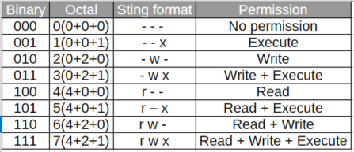

## Why permissions matter

On a multi‑user system like Linux, **permissions control who can access which files and what they can do with them**.
They are a cornerstone of system security, multi‑user isolation, and safe service configuration.

Common goals:
- Stop other users from reading your private files.
- Prevent accidental deletion or modification of system files.
- Allow teams or services to share exactly what they need and nothing more.

--- 

## The absolute basics: users, groups, and files

Every file and directory in Linux has **an owner (user)** and **a group**.
Permissions are then defined for three categories:

- **User (u)** – the owner of the file.
- **Group (g)** – users in the file’s group.
- **Others (o)** – everyone else on the system.

You can see this information with `ls -l`
```bash
root@Prabhu:~/prasad# ls -l sample.txt
-rwxrwxrwx 1 root root 3094 Jun 12  2025 sample.txt
root@Prabhu:~/prasad#
```
Breakdown:
- `-` – regular file (we’ll see other types in a moment).
- `rw-` – permissions for the **user** (owner) `root`.
- `r--` – permissions for the **group** `root`.
- `r--` – permissions for **others**.
- The next columns show link count, owner, group, size, date, and name.

### File types in `ls -l`

The very first character in the long listing indicates **type**:

- `-` – regular file.
- `d` – directory.
- `l` – symbolic link.
- `c` – character device.
- `b` – block device.
- `s` – socket.
- `p` – named pipe (FIFO).

Example: 

```bash
root@Prabhu:~/prasad# ls -l
total 40
drwxr-xr-x 5 root    root  4096 Feb 25 16:44 ansible
lrwxrwxrwx 1 root    root     9 Jan 28 19:35 fileSym -> temp1.txt
drwxr-xr-x 5 root    root  4096 Dec 27 17:25 my-ansible-lab
-rwxrwxrwx 1 root    root  3094 Jun 12  2025 sample.txt
```

---

## Understanding `r`, `w`, `x`: what they actually do




Permissions differ slightly for **files** and **directories**.

### For regular files

- `r` (read): you can view the file contents.
- `w` (write): you can modify or truncate the file.
- `x` (execute): you can run the file as a program or script.

Example:

```bash
$ ls -l script.sh
-rwxr-xr-- 1 prasadg devs 123 May  1 11:00 script.sh
```

- User `prasadg`: `rwx` – can read, edit, and execute.
- Group `devs`: `r-x` – can read and execute but not edit.
- Others: `r--` – can only read.

### For directories

- `r` (read): list the names inside (`ls`).
- `x` (execute / traverse): enter or traverse directory (`cd`, open files under it).
- `w` (write): create, delete, or rename entries inside the directory.

```bash
$ ls -ld /srv/data
drwxr-x--- 2 prasadg devs 4096 May  1 11:10 /srv/data
```

- User `prasadg`: `rwx` – can list, traverse, create/delete entries.
- Group `devs`: `r-x` – can list and traverse but not create/delete.
- Others: `---` – cannot even see or enter the directory.

**Key point:** For directories, you usually need both `r` and `x` to work comfortably: `r` to list and `x` to traverse

--- 

## Changing permissions with `chmod`

`chmod` (**ch**ange file **mod**e) is the main tool to modify permissions.
There are two modes:

- **Symbolic**: human‑friendly (`u+rwx`, `g-w`).
- **Numeric (octal)**: compact and script‑friendly (`chmod 640 file`).

### Symbolic mode

Syntax:

```bash
chmod [ugoa][+-=][rwx] file
```

- `u` – user (owner).
- `g` – group.
- `o` – others.
- `a` – all (u+g+o).
- `+` – add permission.
- `-` – remove permission.
- `=` – set exactly these permissions.

Examples (run inside `~/perm-lab`):

```bash
# Start from a known state
$ chmod 644 file1
$ ls -l file1
-rw-r--r-- 1 prasadg prasadg 0 May  1 11:25 file1

# Add execute for user
$ chmod u+x file1
$ ls -l file1
-rwxr--r-- 1 prasadg prasadg 0 May  1 11:26 file1

# Remove read from others
$ chmod o-r file1
$ ls -l file1
-rwxr----- 1 prasadg prasadg 0 May  1 11:27 file1

# Give read to everyone
$ chmod a+r file1
$ ls -l file1
-rwxr-xr-x 1 prasadg prasadg 0 May  1 11:28 file1
```

### Numeric (octal) mode

Permissions map to numbers:

- `r` = 4
- `w` = 2
- `x` = 1

Add them per role (user, group, others):

- `7` = `rwx` (4+2+1)
- `6` = `rw-` (4+2)
- `5` = `r-x` (4+1)
- `4` = `r--`
- `0` = `---`

Order is always **user, group, others**.

Examples:

```bash
# user: rw-, group: r--, others: r--
chmod 644 file1   # -rw-r--r--

# user: rwx, group: r-x, others: r-x
chmod 755 file1   # -rwxr-xr-x

# user: rw-, group: r--, others: ---
chmod 640 file1   # -rw-r-----
```

A useful pattern for private configuration files is `600` (only the owner can read/write).
For public executables and directories, `755` is very common.

---

## Changing ownership with `chown` and `chgrp`

Sometimes you need to change **who** owns a file or which **group** it belongs to.

- `chown` – change file owner (and optionally group).
- `chgrp` – change group only.

These usually require `sudo` (root privileges), because normal users cannot arbitrarily give away files.

Examples (run in a test VM where you have sudo):

```bash
# Change owner to user 'bob'
$ sudo chown bob file1

# Change owner and group
$ sudo chown bob:devs file1

# Change only group
$ sudo chgrp devs file1
```

Recursive change on a directory tree:

```bash
$ sudo chown -R webuser:webgroup /var/www/my-site
$ sudo chgrp -R devs /srv/project
```

This is how you align file trees with service accounts and project groups.

---

## Default permissions: understanding `umask`

So far we changed permissions of existing files.
But what about **newly created** files and directories?
That’s where **umask** comes in.

> **Umask** defines which permission bits will be *turned off* by default for new files and directories

### Viewing your umask

```bash
$ umask
0022
```

### How umask works

Think of it as:

> effective_permissions = default_permissions AND (NOT umask)

- Default permissions for **files**: `666` (rw‑rw‑rw‑) – no execute by default.
- Default permissions for **directories**: `777` (rwxrwxrwx).

Example with `umask 022`:

- New file: `666 & ~022 = 644` → `-rw-r--r--`.
- New dir: `777 & ~022 = 755` → `drwxr-xr-x`.

### Trying it out

```bash
$ umask 022      # set temporarily in this shell
$ touch f1
$ mkdir d1
$ ls -ld f1 d1
-rw-r--r-- 1 prasadg prasadg    0 May  1 11:40 f1
drwxr-xr-x 2 prasadg prasadg 4096 May  1 11:40 d1

$ umask 077
$ touch f2
$ mkdir d2
$ ls -ld f2 d2
-rw------- 1 prasadg prasadg    0 May  1 11:41 f2
drwx------ 2 prasadg prasadg 4096 May  1 11:41 d2
```

With `umask 077` new files are private by default.
You can later place permanent umask settings in shell startup files like `~/.bashrc` or service unit files.

